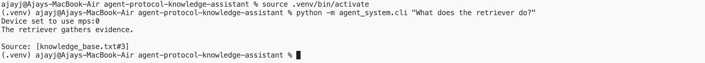
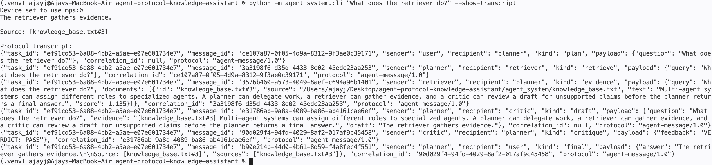
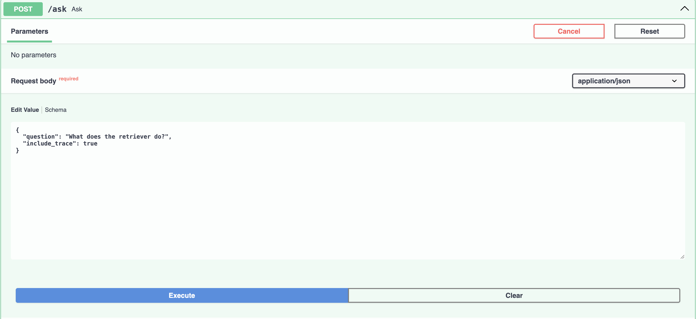
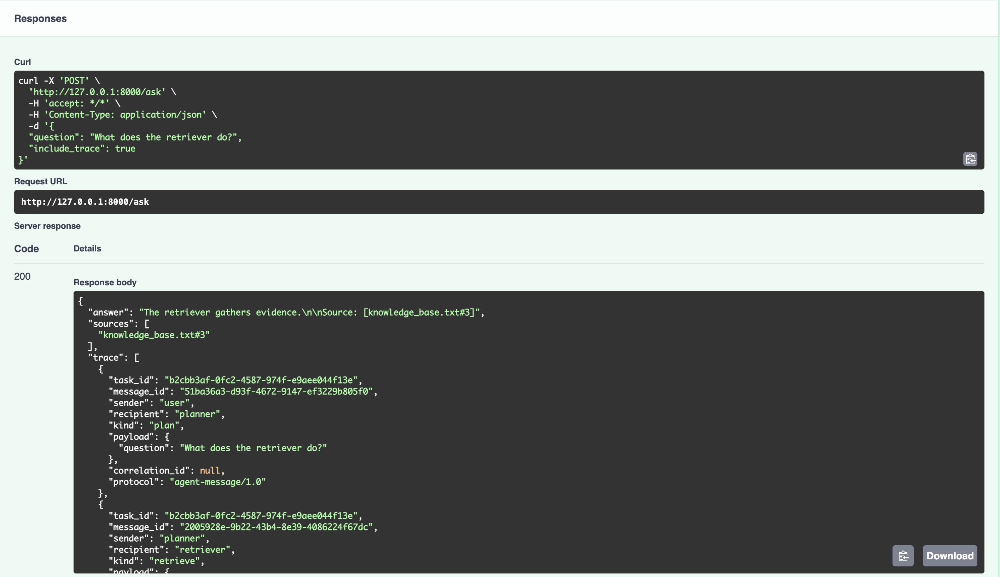
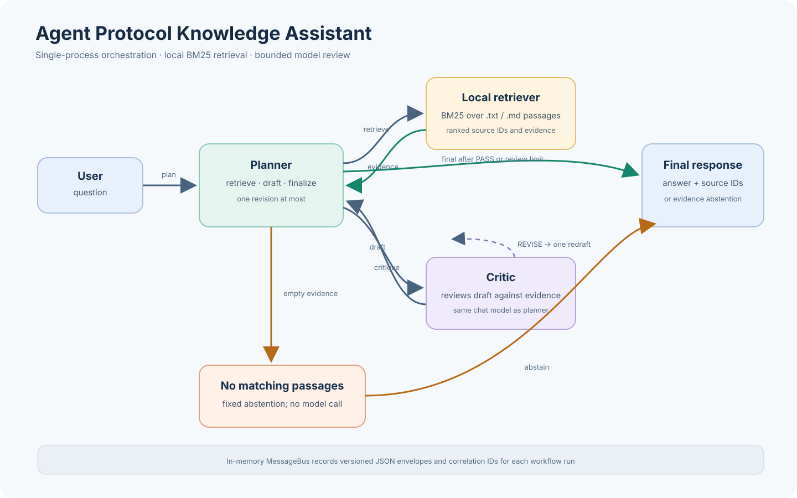
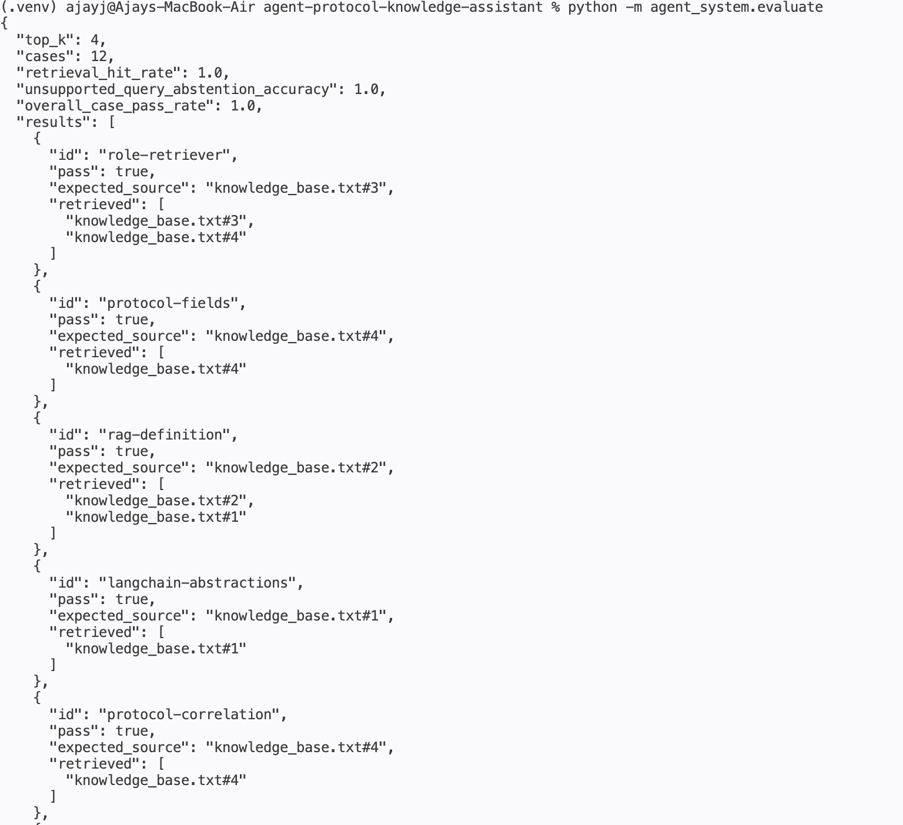
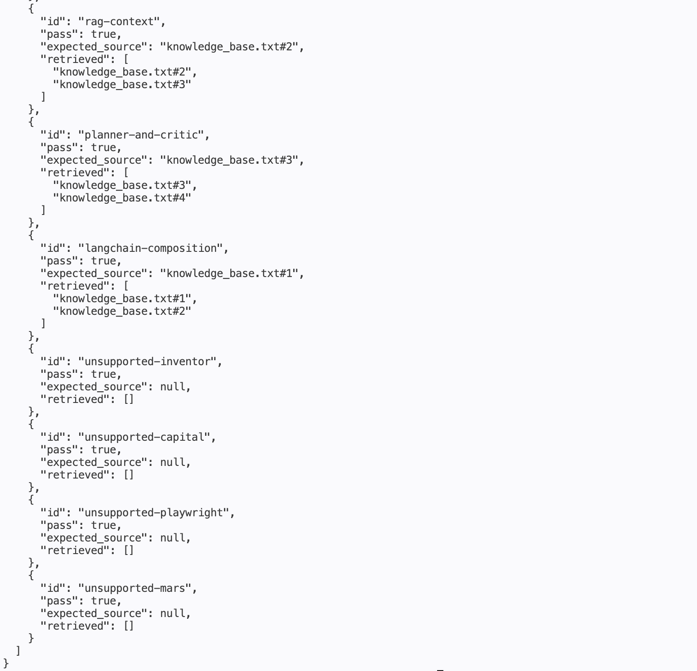

# Agent Protocol Knowledge Assistant

A local, evidence-grounded question-answering demo built with Python, LangChain LCEL, Hugging Face, and FastAPI. A planner requests passages from a local BM25 retriever, drafts an answer from that evidence, and asks a critic to review the draft. The planner may revise once. Answers cite passage IDs, and the workflow abstains in code when retrieval returns no passages.

This repository demonstrates explicit agent roles and versioned message envelopes in a single Python process. It does not implement or connect to the network protocols MCP or A2A.

## Table of Contents

1. [Overview](#1-overview)
2. [Key Features](#2-key-features)
3. [Technology Stack](#3-technology-stack)
4. [Getting Started](#4-getting-started)
5. [Usage](#5-usage)
6. [Project Structure](#6-project-structure)
7. [Architecture and Workflow](#7-architecture-and-workflow)
8. [Results and Evaluation](#8-results-and-evaluation)
9. [Limitations](#9-limitations)
10. [Future Improvements](#10-future-improvements)

## 1. Overview

The assistant answers questions using a local collection of plain-text or Markdown notes. It is intended as a small reference implementation for developers exploring role-based agent orchestration, local retrieval, evidence-grounded generation, and inspectable handoffs.

The default corpus is `agent_system/knowledge_base.txt`. At startup, the retriever splits each supported file into passages separated by blank lines, assigns each passage an ID, and indexes its terms in memory. For each question, the workflow retrieves up to four matching passages by default. The planner and critic use the selected language model through LangChain prompt/model/parser chains.

When there are no matching passages, the workflow returns a fixed abstention without invoking the model. With evidence present, the model produces a draft, the critic returns feedback, and the planner can make one revision. The final answer includes a source reference; if the draft lacks a recognized reference, the workflow appends the top-ranked passage ID.

**CLI example:** The local workflow returns an answer with a source reference.



## 2. Key Features

- **Three agent roles:** the planner orchestrates, the retriever returns ranked passages, and the critic checks a draft against the question and evidence.
- **Explicit message envelopes:** handoffs carry a protocol version, task and message IDs, sender, recipient, message kind, JSON-compatible payload, and optional correlation ID.
- **Local lexical retrieval:** a dependency-free BM25 implementation indexes `.txt` and `.md` passages without a vector database or embedding service.
- **Bounded review:** the workflow runs an initial draft and can run at most one revision after critique.
- **No-evidence abstention:** if retrieval returns no passages, code returns an abstention rather than relying only on an LLM instruction.
- **Citation fallback:** a retrieved source ID is appended when the draft does not contain an exact ID among the retrieved passages.
- **Local model option:** the default Hugging Face model is `Qwen/Qwen2.5-1.5B-Instruct`; its first use requires downloading model files.
- **Optional OpenAI model option:** the CLI can use `langchain-openai` when an API key is configured.
- **CLI and HTTP interfaces:** ask questions from a terminal or use the optional FastAPI service.
- **Evaluation harness:** a bundled 12-case JSON set exercises expected-source retrieval and no-evidence abstention, with an optional model-backed path.

## 3. Technology Stack

| Component | Implementation | Repository evidence |
| --- | --- | --- |
| Language | Python 3.10 or newer | `pyproject.toml` |
| Agent prompt chains | LangChain Core LCEL | `workflow.py`, `agents.py` |
| Local model integration | LangChain Hugging Face, Transformers, PyTorch | `local_model.py` |
| Optional hosted model integration | LangChain OpenAI | `cli.py` |
| HTTP API | FastAPI and Uvicorn | `api.py` |
| Passage ranking | In-repository BM25 implementation | `retrieval.py` |
| Evaluation cases | JSON | `eval_cases.json` |

Dependency ranges are declared in `pyproject.toml`. The project does not pin a lockfile, so installed package patch versions depend on the environment at install time. The default model ID is configured in the Python source; no model weights are committed to this repository.

## 4. Getting Started

### Prerequisites

- Python 3.10 or newer.
- Internet access on first use of the default Hugging Face model, unless its files are already cached.
- Disk space for model weights and Python dependencies. The model card currently describes the model files; actual disk use depends on the download and cache format.
- A PyTorch build suitable for your hardware. CPU is supported by the installed build but can be slow; available acceleration depends on the PyTorch environment.

No API credentials are required for the default local-model path. The optional OpenAI provider requires an API key. The API service is optional and requires the `api` extra.

### Install

Run from the repository root:

```bash
python3 -m venv .venv
source .venv/bin/activate
python -m pip install --upgrade pip
python -m pip install -e '.[local,api]'
```

For CLI use with local inference and evaluation, install `.[local]`. For the optional hosted CLI provider, install `.[openai]`. The API needs `.[api]` in addition to `.[local]` because the service currently creates a local Hugging Face model at startup.

The package also declares an `agent-demo` console script. After an editable install, invoke it with:

```bash
agent-demo "What does the retriever do?"
```

### First-run model download

The default local model is `Qwen/Qwen2.5-1.5B-Instruct`. `create_local_chat_model` loads it through a Transformers text-generation pipeline. The first CLI question, end-to-end evaluation, or API startup may download model files from Hugging Face into the cache configured by the local Hugging Face environment. Subsequent runs can use the cached files.

Set `HF_MODEL` or pass `--model` to select a different compatible Hugging Face model. Compatibility, memory needs, speed, and output quality vary by model and hardware.

The CLI screenshot in [Overview](#1-overview) shows a successful local-model run. The first invocation may also print a device selection message and download model files before returning an answer.

## 5. Usage

### Ask a question with the CLI

```bash
python -m agent_system.cli "What does the retriever do?"
```

The CLI uses the local Hugging Face provider by default. It prints the answer and source reference. To inspect the in-process handoffs:

```bash
python -m agent_system.cli "What does the retriever do?" --show-transcript
```

The question can also be entered interactively by omitting the positional argument:

```bash
python -m agent_system.cli
```

To inspect the versioned messages exchanged during a request, add `--show-transcript`:

```bash
python -m agent_system.cli "What does the retriever do?" --show-transcript
```

The transcript includes the plan, retrieval request, evidence, draft, critique, and final response.



### Choose a corpus

Pass a `.txt` or `.md` file, or a directory containing such files:

```bash
python -m agent_system.cli "What do these notes say about protocols?" --knowledge ./my-notes
```

Directories are searched recursively. Files are read as UTF-8. Each non-empty paragraph split by a blank line becomes a passage. The passage ID uses the file basename and one-based paragraph position, for example `guide.md#2`. IDs do not include a directory path, so files with duplicate basenames can produce colliding IDs. PDF, Word, HTML, and other formats are not parsed.

### Select a model provider

Local provider options:

```bash
HF_MODEL="Qwen/Qwen2.5-1.5B-Instruct" python -m agent_system.cli "What is RAG?"
python -m agent_system.cli "What is RAG?" --provider local --model "Qwen/Qwen2.5-1.5B-Instruct"
```

The CLI also accepts `LLM_PROVIDER=local` (the default). For the optional OpenAI provider, install `.[openai]` and configure credentials in your shell:

```bash
export OPENAI_API_KEY="your-api-key"
export OPENAI_MODEL="gpt-4o-mini"
python -m agent_system.cli "What does the retriever do?" --provider openai
```

`--model` overrides `OPENAI_MODEL`. The key is consumed by the OpenAI client; never commit a real key to the repository. The FastAPI service does not currently expose this provider option and always initializes the local model.

### Start the HTTP API

With the `local` and `api` extras installed, run:

```bash
uvicorn agent_system.api:app --host 127.0.0.1 --port 8000
```

The service constructs the model and workflow during application startup. Routes:

| Method | Path | Behavior |
| --- | --- | --- |
| `GET` | `/` | Returns service name and route links. |
| `GET` | `/health` | Returns status, provider, and configured model ID. |
| `POST` | `/ask` | Runs a question; can optionally include the protocol transcript. |
| `GET` | `/docs` | Serves FastAPI's interactive API documentation. |

Example request:

```bash
curl -X POST http://127.0.0.1:8000/ask \
  -H 'Content-Type: application/json' \
  -d '{"question":"What does the retriever do?","include_trace":true}'
```

Example response shape:

```json
{
  "answer": "The retriever gathers evidence.\n\nSource: [knowledge_base.txt#3]",
  "sources": ["knowledge_base.txt#3"],
  "trace": []
}
```

The answer text depends on the model response. The example illustrates the schema; the trace array is populated when `include_trace` is `true` and set to `null` otherwise. Requests require a non-empty question of at most 2,000 characters.

### Configuration reference

| Setting | Used by | Default | Purpose |
| --- | --- | --- | --- |
| `HF_MODEL` | CLI and API | `Qwen/Qwen2.5-1.5B-Instruct` | Hugging Face model ID for local inference. |
| `KNOWLEDGE_PATH` | API | Bundled `agent_system/knowledge_base.txt` | File or directory to index at API startup. |
| `LLM_PROVIDER` | CLI | `local` | Default CLI provider (`local` or `openai`). |
| `OPENAI_API_KEY` | CLI OpenAI provider | None | Credential required for OpenAI requests. |
| `OPENAI_MODEL` | CLI OpenAI provider | `gpt-4o-mini` | Default OpenAI chat model ID. |

The CLI corpus is selected with `--knowledge`; the API corpus is selected with `KNOWLEDGE_PATH`. Evaluation selects its corpus with `--knowledge`. These paths are read when each workflow or retriever is constructed, not watched for later changes.

The screenshots below show the request submitted in Swagger UI followed by the successful response with its answer, source list, and trace.





## 6. Project Structure

```text
.
├── README.md
├── pyproject.toml
└── agent_system/
    ├── __init__.py
    ├── agents.py
    ├── api.py
    ├── cli.py
    ├── eval_cases.json
    ├── evaluate.py
    ├── knowledge_base.txt
    ├── local_model.py
    ├── protocol.py
    ├── retrieval.py
    └── workflow.py
```

| File | Responsibility |
| --- | --- |
| `pyproject.toml` | Package metadata, Python requirement, dependency extras, console script, and included data files. |
| `agent_system/cli.py` | CLI arguments, interactive question input, provider selection, model setup, workflow call, and optional transcript output. |
| `agent_system/api.py` | FastAPI request/response models, startup lifecycle, health/index routes, and `/ask`. |
| `agent_system/workflow.py` | Planner chain, agent orchestration, evidence formatting, abstention, review loop, citation fallback, and final message. |
| `agent_system/agents.py` | Retriever and critic message handlers, plus model-output cleanup. |
| `agent_system/retrieval.py` | Corpus loading, paragraph IDs, tokenization, stop-word filtering, BM25 scoring, and top-k results. |
| `agent_system/protocol.py` | Immutable message envelope and task-scoped in-memory message bus. |
| `agent_system/local_model.py` | Factory for the local Hugging Face chat model. |
| `agent_system/knowledge_base.txt` | Small bundled demonstration corpus. |
| `agent_system/eval_cases.json` | Twelve curated evaluation cases with expected source IDs or `null`. |
| `agent_system/evaluate.py` | Retrieval/abstention scoring and optional end-to-end model evaluation. |

## 7. Architecture and Workflow

### Components

1. **Entry point:** The CLI or API receives a question and constructs or reuses an `AgentWorkflow`. The CLI constructs a workflow for each invocation. The API constructs one workflow at startup and reuses it for requests.
2. **Planner:** `AgentWorkflow` creates a task ID and a message bus, accepts the plan message, and sends a retrieval request containing the user's question. Its LCEL chain formats evidence and calls the selected chat model to draft an answer.
3. **Retriever:** `LocalRetriever` reads the configured corpus when constructed. It splits content on blank lines, lowercases and tokenizes terms matching `[a-z0-9]+`, drops terms shorter than three characters and a small stop-word list, then ranks matching passages with BM25-style scoring.
4. **Critic:** `CriticAgent` sends the question, selected evidence, and draft to a separate prompt chain using the same model object. Its prompt requests `VERDICT: PASS` or `VERDICT: REVISE` and evidence-specific feedback.
5. **Message bus:** `MessageBus` checks that each message belongs to its task and is routed to its stated recipient, then appends it to an in-memory transcript. The bus does not dispatch over a network or validate a formal external protocol schema.
6. **Final response:** The planner sends a final message to the user. The API extracts its answer and source list; the CLI prints its answer. A transcript can be included through the CLI flag or API request option.

### Supported-evidence workflow

1. The user submits a question.
2. The planner sends a `retrieve` message to the retriever.
3. The retriever ranks passages and replies with an `evidence` message correlated to the request.
4. The planner formats the passages with their IDs and asks the model for a concise answer using only that evidence.
5. The planner sends the draft to the critic.
6. If the critic requests revision in its feedback, the planner may create one revised draft and send it for a second review. The loop is capped at two drafts total.
7. The planner adds the top-ranked passage ID if no exact retrieved citation appears in the draft, then returns the final answer and retrieved source list.

### No-evidence workflow

1. The user submits a question.
2. The retriever returns an empty document list, for example when there are no indexed documents or no query-term matches.
3. The workflow returns a fixed abstention directly. It does not ask the language model to answer that question and does not send a draft to the critic.

### Message envelope

Messages use the `agent-message/1.0` identifier. A typical retrieval request has this shape:

```json
{
  "protocol": "agent-message/1.0",
  "task_id": "task-uuid",
  "message_id": "message-uuid",
  "sender": "planner",
  "recipient": "retriever",
  "kind": "retrieve",
  "payload": {"query": "What does the retriever do?"},
  "correlation_id": "plan-message-uuid"
}
```

Message kinds in the implementation are `plan`, `retrieve`, `evidence`, `draft`, `critique`, and `final`. IDs are generated with UUIDs. The example UUID strings above are illustrative. The envelope is an in-process data structure and JSON serialization format; it is not an implementation of MCP, A2A, or another interoperable transport.

### Citation and abstention semantics

The workflow abstains only when retrieval returns no passages. BM25 can return lexically matching but insufficient evidence; the critic and prompt are intended to catch issues but cannot guarantee correctness. The citation fallback establishes traceability to a retrieved passage, but does not prove that every answer claim is supported. The API's `sources` field lists retrieved passage IDs, even if the answer text cites only one.



## 8. Results and Evaluation

### Evaluation commands

Run the fast retrieval and no-evidence gate evaluation without loading an LLM:

```bash
python -m agent_system.evaluate
```

Run retrieval plus model-backed answer, citation, abstention, and critic checks:

```bash
python -m agent_system.evaluate --end-to-end
```

Both commands print a JSON report to standard output. The default retrieval cutoff is four passages. To change it, or use a different corpus:

```bash
python -m agent_system.evaluate --top-k 2 --knowledge ./my-notes
```

For the end-to-end run, choose a local model with `--model MODEL_ID`. There is no CLI option in the evaluator for the OpenAI provider.

### Metrics and scoring

The bundled `eval_cases.json` contains eight answerable questions, each with one expected source ID, and four questions whose expected source is `null`. The evaluation code applies these checks:

- **Retrieval hit rate:** fraction of answerable cases where the expected ID appears in the top-k retrieval results.
- **Unsupported-query abstention accuracy:** fraction of null-source cases where retrieval returns no results.
- **Overall case pass rate:** fraction of all cases that pass the corresponding retrieval/no-results check.
- **Expected-source citation rate (end-to-end):** fraction of answerable answers containing the exact expected source ID in square brackets.
- **Unsupported abstention accuracy (end-to-end):** fraction of unsupported cases whose answer contains the workflow's fixed abstention phrase.
- **Critic pass rate (end-to-end):** fraction of answerable cases for which the last recorded critic feedback contains `VERDICT: PASS`.

The evaluation is a small, hand-authored check against the bundled corpus, not a general quality benchmark. Expected IDs must be updated when the corpus changes. The end-to-end critic uses the same model as the planner and is not an independent verifier. Citation scoring checks for an ID string; it does not assess semantic entailment. The source fallback can affect citation coverage. Model output, package versions, hardware, and randomness can affect end-to-end results.

### Recorded bundled-corpus run

The included evaluation screenshots show one run of `python -m agent_system.evaluate` against the bundled corpus with the default `top_k` of four. In that run, retrieval hit rate, unsupported-query abstention accuracy, and overall case pass rate were each **1.000** across the 12 bundled cases. This is a small, hand-authored check against the example corpus, not a general quality benchmark or a guarantee for other corpora.

To reproduce and compare a run, retain the emitted JSON together with the corpus revision, evaluation-case revision, command, package environment, and hardware/backend. For example:

```bash
python -m agent_system.evaluate --end-to-end --top-k 4 --model Qwen/Qwen2.5-1.5B-Instruct
```

For model-backed evaluation, also record the model ID. The local model pipeline enables sampling with temperature `0.1` and `top_p` `0.9`; therefore identical answers are not guaranteed across runs. Store the full JSON output outside the repository unless you intentionally want to publish a benchmark artifact.

The report was captured from the command above using the bundled corpus and default top-k of four. The first image contains the report summary and answerable cases; the second continues with the remaining cases, including unsupported questions.





## 9. Limitations

- Retrieval is lexical BM25-style ranking, not semantic search. Paraphrases with little term overlap can be missed.
- The tokenizer is deliberately simple and does not perform stemming, language detection, or robust Unicode tokenization.
- Only UTF-8 `.txt` and `.md` files are read. Passage boundaries depend on blank lines, and source IDs use basenames, which may collide across folders.
- A matching passage is not necessarily sufficient evidence. The workflow abstains on zero retrieval results, but does not independently measure evidence sufficiency.
- The planner and critic are prompted language-model chains. Critic output may be wrong or malformed, and the critic shares the planner's model.
- A citation is a source pointer, not a correctness guarantee. Citation fallback attaches the top-ranked source when the model omits a citation.
- Messages, transcripts, and retrieval indexes live only in process memory. There is no persistence, queue, authentication, or distributed execution.
- The API has no authentication, rate limiting, or production deployment configuration. The documented command binds to localhost for development.
- Local model startup and inference can require substantial memory and can be slow on CPU. Model loading depends on the installed PyTorch and Transformers compatibility.
- The default API workflow is local-model only. The optional OpenAI provider exists in the CLI path.
- The benchmark set is small and tailored to the example knowledge base; it does not support broad claims about answer quality.
- No `LICENSE` file is present in the repository, so the project license is unspecified. Add the intended license before publishing if you want to grant reuse rights.

## 10. Future Improvements

- Add stable, collision-resistant source IDs that preserve relative paths or file hashes.
- Add document loaders for PDF and other formats, with explicit extraction and provenance behavior.
- Add retrieval diagnostics, configurable BM25 parameters, and optional semantic retrieval or reranking.
- Add a configurable evidence threshold and tests for malformed or weakly relevant evidence.
- Track model, library, hardware, corpus, and benchmark revisions in machine-readable evaluation reports.
- Add repeatable benchmark runs and a larger, independently reviewed test set.
- Add structured critic output validation rather than parsing verdict strings from free-form text.
- Expose backend choice and model configuration consistently through the API, with appropriate secret handling.
- Add persistence and deployment controls only if the project grows beyond its local demonstration scope.
